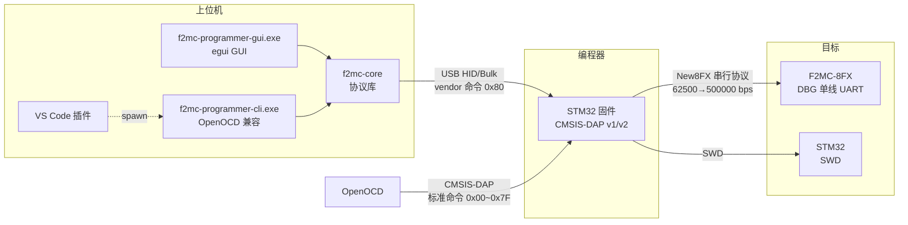
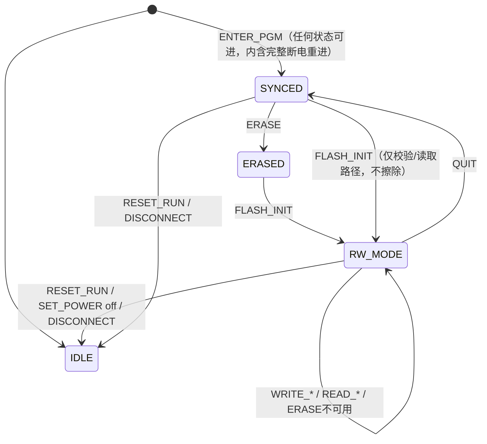

# 上位机使用说明（F2MC Studio）

> 版本 v0.2.0
> 平台：Rust ≥ 1.85；Windows / Linux（WSL）
> 源码：`hmi/`；固件侧说明见 `docs/固件使用说明.md`，协议依据见 `docs/通信协议约定.md`

## §1 核心功能

F2MC-8FX / STM32 双路编程器的上位机软件套件：Rust workspace（`hmi/`），包含协议库、
工业风格 GUI、命令行工具（OpenOCD 兼容桥接），支持全部 216 款 F2MC-8FX 芯片的烧录、
校验、读取与擦除。

### 1.1 F2MC-8FX 路径（自研 vendor 协议）

| 功能 | 说明 |
|---|---|
| 芯片支持 | 全部 216 款 FMC8FX 型号（内置型号库，关键词检索），自动识别双 bank Flash 布局 |
| 镜像格式 | Intel HEX（.hex/.ihx/.ehx）与 Motorola S-record（.mhx/.s19/.mot）自动嗅探 |
| 烧录 | 整片擦除 → 分块写入（≤512B/块）→ 读回校验，36KB 全片约 25~40 s |
| 安全锁 | 可选写入安全位 `0xFFFC=0x01`；锁片自动整片擦除解锁后重试 |
| NVR 保护 | 解析镜像时自动剔除 `0xFFBB~0xFFBF` 与 `0xFFFC`（告警）；校验跳过 `0xFFBB/BC/BD` |
| CR Trimming | 擦除后与烧录后各检查一次 `0xFFBB/BC/BD` 与 RAM 镜像 `0x0FE7/0FE4/0FE5`，失配经普通写路径回写 |
| 会话保持 | 烧录/校验/读取可连续执行，自动跳过已完成的进模式步骤 |
| 强制取消 | ABORT(0x12) 带外中止长操作（握手等待/擦除等待），秒级响应 |
| 双通道 | CMSIS-DAP v2（Bulk）优先，v1（HID，Win7 保底）自动回退、同设备自动去重 |

### 1.2 STM32 路径（probe-rs 0.32.0 精确锁定）

| 功能 | 说明 |
|---|---|
| 芯片支持 | probe-rs 内置目标库全系 STM32（F0/F1/F2/F3/F4/F7/G0/G4/H7/L0/L1/L4/U5/WB…），关键词检索或自动识别 |
| 自动识别 | 两级回退：先 probe-rs Auto（ROM 表），失败后读 DBGMCU_IDCODE（内置 29 个 DEV_ID 映射 + 容量寄存器细分 F1 密度）；勾选时手动选择灰化不可选 |
| SWD 速率 | 1/2/4/8 MHz 可选（默认 4 MHz，实测 4 MHz 烧录 ~7 s） |
| 镜像格式 | Intel HEX / BIN / ELF（按扩展名判定，优先级 hex > bin > elf；BIN 可输烧入地址，默认 0x08000000） |
| 烧录 | probe-rs flash 算法：扇区擦除 → 分页写入，可选烧录后自动校验 |
| 整片擦除 | `allow_erase_all` 权限 + 芯片内置 mass erase |
| 复位运行 | NVIC SYSRESETREQ 软件复位（无需硬件复位线） |
| 取消 | probe-rs 页内不可中断，取消令牌在阶段边界生效 |

同时支持经原生 OpenOCD 烧录（`openocd/` 目录提供探针与目标 cfg，见 §4.4）。

### 1.3 交付形态

- **f2mc-programmer-gui.exe**（F2MC Studio，3 MB，egui 工业风 GUI）：连接/文件/操作三区布局、进度与取消、
  分级日志（时间戳/导出）、深浅主题、设置持久化、拖放烧录文件
- **f2mc-programmer-cli.exe**（162 KB，命令行）：原生子命令 + **OpenOCD 兼容模式**，
  供 CI、脚本与 VS Code 插件以 openocd 习惯调用（OpenOCD 风格 `Info :`/`Error:` 日志与退出码）

---

## §2 系统架构



---

## §3 通信协议

> 本章为 L1（上位机 ↔ 编程器，CMSIS-DAP vendor 命令）摘要。协议唯一依据见 `docs/通信协议约定.md`；
> L2（编程器 ↔ 目标 MCU，New8FX 串行协议）见 `docs/固件使用说明.md` §2。

### 3.1 传输层（USB）

- 编程器在同一 USB 配置中提供两个接口：**Interface 0 = CMSIS-DAP v1（HID）**、**Interface 1 = CMSIS-DAP v2（Bulk）**
- 上位机枚举优先 v2，失败/不存在回退 v1
- F2MC 全部操作走厂商命令 **`ID_DAP_Vendor0` = `0x80`**（ARM 官方预留 0x80~0x9F）；
  标准 DAP 命令（0x00~0x7F）服务 STM32 路径
- 包长：v1 = HID 报告 64 B；v2 = Bulk 包 ≤64 B；**应用层统一按单包载荷 ≤ 56 B 设计**
- 编程器执行单条命令期间不响应新命令（上位机串行发命令）

### 3.2 应用帧

```
请求:  [0x80] [CMD] [LEN_L] [LEN_H] [PAYLOAD(LEN ≤ 56 B)]
响应:  [0x80] [STATUS] [DATA...]
```

- 多字节整数一律**小端（LE）**；响应首字节 ≠ 0x80、缺 STATUS 或长度不符 → 传输错误，重试一次
- 收到状态码 ≠ 0x00 时，不得继续后续流程步骤（除明确标注可重试的场景）
- **响应迟到处理**：命令超时后不得立即发新命令——固件可能仍在执行（如 ENTER_PGM 失败路径最长 ~7 s），
  应先持续读直到迟到响应到达（或 GET_STATE 轮询确认固件空闲）后再继续

### 3.3 命令集

| CMD | 名称 | 请求 PAYLOAD | 响应 DATA | 超时 | 说明 |
|---|---|---|---|---|---|
| 0x01 | PING | 空 | `"F2MC-LINK"` + FW版本(3B) | 1 s | 连通性与固件版本 |
| 0x02 | SET_POWER | [on:1B] | — | 5 s | 目标 VCC 开关（F2MC-LINK v1.1 光电管开关，通流 ≤50mA 仅裸片烧录）。on=1 上电并做 3 s 上升确认，过载/短路/未接目标自动关断并回 PWR_FAULT(0x0C)；on=0 断电且状态机复位 IDLE。ENTER_PGM 内部已含自动断电→上电，上位机一般无需显式调用 |
| 0x03 | ENTER_PGM | 空 | — | 40 s | 完整进模式序列：自动断电 → 上电 → DBG 拉低 1.2 s → 释放 → 握手 → 时钟修改。**任何状态可进**（内部含完整断电重进，上位机无需先 QUIT/RESET_RUN）；握手失败时固件自动整循环重试 ×3（烧录恢复）。典型 ~3-4 s |
| 0x04 | ERASE | [AddrH, AddrL] | — | 90 s | 整片擦除 Addr=0x0000；扇区擦除 Addr=扇区内地址。固件等待上限 60 s |
| 0x05 | FLASH_INIT | [XX, YY] | — | 5 s | 下载 INIT DA.BIN 并切换波特率。`XX=0x02, YY=0x7C`。DA 固件内嵌，按 SET_CHIP 下发的型号匹配 |
| 0x06 | WRITE_BEGIN | [AddrH, AddrL, LenH, LenL] | — | 1 s | Len ≤ 512 B；固件分配缓冲 |
| 0x07 | WRITE_DATA | [Data ≤ 56 B] × ⌈Len/56⌉ | — | 1 s/包 | 顺序追加到缓冲 |
| 0x08 | WRITE_COMMIT | 空 | — | 5 s | 缓冲数据一次性执行目标写入 |
| 0x09 | READ_BEGIN | [AddrH, AddrL, LenH, LenL] | — | 2 s | Len ≤ 1024 B；固件立即从目标读入缓冲 |
| 0x0A | READ_DATA | 空 | Data ≤ 56 B | 1 s/包 | 顺序取回，取满 Len 为止 |
| 0x0B | CR_TRIM_WRITE | [AddrH, AddrL, Data] | — | 2 s | ⚠ 真机 DA 不实现（恒回 ACK_ERROR），保留；CR 恢复请用普通写路径写 0xFFBB |
| 0x0C | QUIT | 空 | — | 2 s | 退出读写模式；固件把 DBG 波特率归位 62500 |
| 0x0D | RESET_RUN | 空 | [cap:1B] | 15 s | 复位目标运行用户程序。无 RST 硬件，经电源开关断电 → 主动放电（等 VCC<0.5V 并保持 300ms 保证 POR 深度）→ 上电；`cap` 上报复位能力：`0x00`=原生（复位引脚）/`0x01`=模拟（兼容模式，提示"当前为兼容模式"）。更旧固件恒回 UNSUPPORTED，上位机改走 SET_POWER 断电 → 上电兜底 |
| 0x0E | GET_STATE | 空 | [state:1B, last_error:1B] | 1 s | 排障与状态机感知 |
| 0x0F | WRITE_SECURE | 空 | — | 2 s | 向 0xFFFC 写 0x01（安全锁） |
| 0x10 | SEND_BREAK | 空 | — | 1 s | 向 DBG 发 UART Break（通信恢复手段） |
| 0x11 | DISCONNECT | 空 | — | 1 s | 上位机断开通知：LED 熄灭 + 状态机复位 IDLE；目标侧状态不变。关闭设备前应发送 |
| 0x12 | ABORT | 空 | — | 1 s | 带外强制中止当前长操作：固件 USB ISR 立即置中止标志，原命令以 ABORTED(0x0B) 应答；幂等。⚠ 中止 ENTER_PGM 后目标可能半初始化，重试前建议断电重启 |
| 0x13 | SET_CHIP | [型号名 ASCII ≤ 24 B] | — | 1 s | 下发型号名（如 `MB95F698K`），固件按系列匹配内嵌 DA；上位机在烧录/校验/读取前自动下发，无需手动干预 |

### 3.4 状态机



状态门控（违反返回 `STATE_ERROR`）：

- `ERASE` 仅 SYNCED；`FLASH_INIT` 在 SYNCED 与 ERASED 均可用；`WRITE_*`/`READ_*` 仅 RW_MODE；`ENTER_PGM` **任何状态可进**（pgmseq 内含完整断电重进，握手失败自动整循环重试 ×3）
- `WRITE_DATA` 必须紧跟 `WRITE_BEGIN`（未达 Len 前），`READ_DATA` 必须紧跟 `READ_BEGIN`（未取满前）
- ⚠ QUIT 后的 SYNCED 握手已失效（目标退回 bootloader 世界）：执行 ERASE 前必须重新 ENTER_PGM 握手——固件任何状态可进，上位机直接重进即可（无需先 QUIT/RESET_RUN）
- FLASH_INIT 后目标波特率切到 500 Kbps（固件同步切换 UART）

### 3.5 状态码

| 码 | 名称 | 含义 |
|---|---|---|
| 0x00 | OK | 成功 |
| 0x01 | TIMEOUT | 目标应答超时（含擦除 60 s 等待） |
| 0x02 | SECURITY_LOCKED | 收到 0xFD——目标已加安全锁 |
| 0x03 | ACK_ERROR | 收到非预期 ACK 值 |
| 0x04 | TARGET_CHK_ERROR | 目标侧校验和错误 |
| 0x05 | BAD_PARAM | 请求参数非法 |
| 0x06 | UART_ERROR | 帧错误/溢出等底层错误 |
| 0x07 | STATE_ERROR | 当前状态不允许该命令 |
| 0x08 | FRAME_CRC_ERROR | L1 帧 CRC 错误（保留，未用） |
| 0x09 | BUSY | 上一条命令未执行完 |
| 0x0A | UNSUPPORTED | 硬件/固件不支持 |
| 0x0B | ABORTED | 操作被 ABORT(0x12) 中止 |
| 0x0C | PWR_FAULT | 目标电源故障：过载/短路/未接目标，固件已自动关断 |

### 3.6 安全锁与 NVR 规则

- **安全锁**：`0xFFFC = 0x01` 写入后不立即生效，断电复位或 QUIT 后生效。生效后仅握手 + 整片擦除可用，
  其余命令回 `0xFD` → L1 状态码 `SECURITY_LOCKED`。只在用户显式选择时最后写入；锁片自动整片擦除解锁后重试一次
- **NVR 区（0xFFBB~0xFFBF）**：存 CR 时钟校准/看门狗 ID
  - Blank Check 与 Verify 跳过 `0xFFBB`、`0xFFBC`、`0xFFBD`
  - 解析镜像发现数据落在 `0xFFBB~0xFFBF`，默认剔除并告警（防止覆盖校准值）
  - **CR Trimming 检查**（0.18µm 产品含 MB95630H）：擦除成功后读 `0xFFBB/BC/BD` 与 RAM 镜像
    `0x0FE7/0FE4/0FE5` 比较，不一致则**用普通写命令把 RAM 镜像值写回 0xFFBB**（真机 DA 不实现 Spec 7.9 的 0x55 命令）；
    编程结束后再查一次

### 3.7 性能预算（36KB 典型）

| 阶段 | 典型耗时 |
|---|---|
| 进模式（自动断电上电 + 1.2 s 等待 + 握手） | ~3-4 s |
| 握手 | 11~202 ms |
| FLASH_INIT（141 B） | ~80 ms |
| 整片擦除 | ~1.3 s（固件等待上限 60 s） |
| 读 @500K | ~66 µs/B，36 KB ≈ 2.5 s |
| 写 @500K | ~170 µs/B，36 KB ≈ 6.5 s |
| 整片烧录+校验（35 KB） | ≈ 25~40 s（含 USB 分块开销） |

---

## §4 使用方法

### 4.1 GUI（f2mc-programmer-gui.exe，F2MC Studio）

主页两个大按钮选择目标家族（F2MC-8FX / STM32），顶栏「[ 主页 ]」可随时返回。

**F2MC-8FX 模式**：

1. 连接编程器（USB），左侧「连接」区选择通道（自动去重：同设备只显示 v2），点「连 接」
2. 选择芯片型号（搜索框关键词过滤，如 `F636`）
3. 拖放 `.mhx`/`.hex` 到文件区，或点「浏览…」，解析后显示镜像区间与告警
4. 选择「烧录完成后」动作（复位运行 / 保持编程模式，无默认必须显式选）
5. 点「烧 录」；进度区显示阶段/字节/百分比/耗时，可随时「取消」（ABORT 强制中止）
6. 其他操作：仅擦除、仅校验、读取…（读出保存 .hex/.mhx/.bin）、复位运行、**恢复**
   （烧录恢复：强制进入 + 整片擦除——上次烧录异常导致无法正常烧录时用；固件 ENTER_PGM 内含整循环重试 ×3）
7. 操作可连续执行（会话保持）；结束点「断 开」（发 DISCONNECT 熄 LED）

**STM32 模式**：

1. 选择调试探针与 SWD 速率（默认 4 MHz），自动识别勾选时直接点「连 接」；取消勾选则手动搜索选择型号（灰化互斥）
2. 文件区选择 hex/bin/elf（BIN 需输烧入地址，默认 0x08000000）
3. 操作区：烧录（可选「烧录后自动校验」「烧录后复位运行」）/ 擦除 / 校验 / 复位，阶段显示 擦除→写入→校验 实时切换

### 4.2 CLI（f2mc-programmer-cli.exe）

```powershell
f2mc-programmer-cli probes                                   # 列出探针
f2mc-programmer-cli program app.mhx --chip MB95F636H         # 烧录（hex/mhx 自动识别）
f2mc-programmer-cli program app.hex --secure --no-reset      # 写安全位 + 保持编程模式
f2mc-programmer-cli verify app.hex                           # 仅校验
f2mc-programmer-cli erase                                    # 整片擦除（锁片也可解锁）
f2mc-programmer-cli recover                                  # 烧录恢复（强制进入+整片擦除）
f2mc-programmer-cli readout dump.hex                         # 读出 0x1000~0xFFFF 存 Intel HEX
```

型号默认 `MB95F636H`，可用 `--chip` 或环境变量 `F2MC_CHIP` 指定。
日志为 OpenOCD 风格 `Info :`/`Warn :`/`Error:` 前缀，退出码 0=成功，1=失败。

### 4.3 OpenOCD 兼容模式（VS Code 插件烧录 F2MC）

> 纯 OpenOCD 无法烧录 F2MC：`cmsis-dap cmd` 只把响应打进日志、不返回给 TCL
> （openocd v0.12.0 源码 `src/jtag/drivers/cmsis_dap.c::cmsis_dap_handle_cmd_command`），
> 状态检查/校验/安全锁检测都做不到——因此采用桥接：插件像调 openocd 一样调 f2mc-programmer-cli。

```powershell
f2mc-programmer-cli --openocd -f openocd/f2mc-target.cfg -c "program app.hex verify reset exit"
f2mc-programmer-cli --openocd -c "verify_image app.hex"
```

- `-s` 参数兼容忽略；`-f` 指定 `openocd/f2mc-target.cfg`（解析 `set F2MC_CHIP/F2MC_SECURE/F2MC_RESET`，
  环境变量 `F2MC_CHIP` 可作默认值；`program` 行内 `reset` 关键字优先于 cfg）
- `-c` 支持 `program/verify_image/init/shutdown/targets/halt/reset/exit`；
  `program` 行内的 `verify/reset/exit` 语义与 openocd 一致（烧录流程本身已含读回校验；`reset` 触发复位提示）
- 插件集成：把"openocd 可执行文件路径"指向 `f2mc-programmer-cli.exe`
  （发布构建产物 `hmi/target/release/f2mc-programmer-cli.exe`），或 spawn 命令行，解析 `Error:`/退出码判败

### 4.4 原生 OpenOCD（烧录 STM32）

配置文件（`hmi/openocd/`）：

| 文件 | 说明 |
|---|---|
| `probe-f2mc.cfg` | 探针适配器配置：CMSIS-DAP + SWD @1 MHz（供其他 cfg `source`） |
| `stm32f1x-burn.cfg` | STM32F1 系列完整烧录配置（探针 + 目标 + 无 SRST 复位策略） |
| `f2mc-target.cfg` | F2MC 目标烧录参数（f2mc-programmer-cli `--openocd` 的 `-f` 文件，非 OpenOCD TCL） |

```powershell
$OC  = '<openocd>\bin\openocd.exe'
$SCR = '<openocd>\share\openocd\scripts'

# 探针自检（无需目标板）
& $OC -s $SCR -s openocd -f probe-f2mc.cfg -c init -c "cmsis-dap info" -c shutdown

# 烧录 + 校验 + 复位运行（hex/bin/elf 均可）
& $OC -s $SCR -s openocd -f stm32f1x-burn.cfg -c "program app.hex verify reset exit"

# 仅校验
& $OC -s $SCR -s openocd -f stm32f1x-burn.cfg -c "init" -c "verify_image app.hex" -c "shutdown"

# 整片擦除
& $OC -s $SCR -s openocd -f stm32f1x-burn.cfg -c "init" -c "halt" -c "stm32f1x mass_erase 0" -c "shutdown"
```

**复位说明**：编程器无 SRST 硬件线，cfg 采用 `reset_config none` + `sysresetreq` 软件复位；
`program ... reset` 的复位运行走 NVIC SYSRESETREQ，无需硬件复位线。

**排障**：

| 现象 | 排查 |
|---|---|
| `Can't find xxx.cfg` | `-s` 路径顺序：先 OpenOCD scripts，后本目录 |
| `Error connecting DP: cannot read IDR` | 目标未供电 / SWDIO、SWCLK、GND 接线 / 目标被读保护 |
| 找不到设备 | 确认编程器已插 USB；且 GUI/f2mc-programmer-cli 未占用（Windows HID 独占）；设备管理器应有 CMSIS-DAP HID/WinUSB 接口 |
| 多探针冲突 | `probe-f2mc.cfg` 中启用 `adapter vid_pid 0x0483 0x5750`（需 OpenOCD ≥0.12 正式版）或 `adapter serial` |
| 读保护 (RDP) | `init` 后 `stm32f1x unlock 0`（会整片擦除） |

---

## §5 构建方式

### 5.1 环境

- Rust ≥ 1.85（开发用 1.97），Windows 与 WSL 均可
- WSL 依赖：`build-essential pkg-config cmake libudev-dev libusb-1.0-0-dev`（GUI 另需 X11/WSLg 字体）
- Windows 依赖：MSVC（VS Build Tools）；hidapi 走 WinUSB/HID 免驱

### 5.2 构建命令

```bash
cargo build --workspace            # 调试构建
cargo build --release -p f2mc-gui -p f2mc-cli   # 发布构建（opt-level=z + lto + strip）
# 产物：target/release/f2mc-programmer-gui.exe 与 target/release/f2mc-programmer-cli.exe
cargo run -p f2mc-gui              # 运行 GUI
cargo run -p f2mc-cli -- --help    # CLI 帮助
```

> ⚠ 杀软可能隔离新生成的 exe（启发式误报）：将项目目录加入排除项即可。

---

## §6 测试方法

### 6.1 自动化测试（35 项，全部离线可跑）

```bash
cargo test --workspace
```

| 层级 | 覆盖 |
|---|---|
| 单元测试（26） | vendor 帧封装/重试规则、BEGIN/DATA/COMMIT 分块、hex/S-record 解析与 NVR 剔除、双 bank 校验、型号库检索、ABORTED→取消映射；**stm32-flash**：STM32 目标库检索/关键词过滤、格式加载器构造、取消令牌、DEV_ID 识别表与目标库一致性 |
| 端到端（9） | **编程器模拟器**（帧级状态机+虚拟 Flash+故障注入）驱动：全流程烧录、安全锁锁定/解锁循环、会话保持连续操作、QUIT 后重进握手、CR Trimming 回写、取消、20 次连续烧录、真实富士通 .mhx 样例烧录 |

### 6.2 真机回归清单

1. PING 显示固件版本（`F2MC-LINK v0.2.0`）
2. 烧录 → 断电复位 → 目标板运行用户程序
3. 烧录（保持编程模式）→ 稍等 → 直接擦除（自动重进握手）
4. 连续执行：烧录 → 校验 → 读取（日志显示"跳过/直进"）
5. 安全位：勾选写安全位 → 断电 → 再烧录（自动解锁提示）
6. 握手超时：目标不上电点烧录 → 点取消（ABORT 秒级中止）→ 提示人工断电
7. 36KB 全片烧录+校验 ≤ 40 s
8. CLI：`f2mc-programmer-cli program/verify/erase` 与 `--openocd` 模式各一遍

**STM32 路径**：

1. 家族切到 STM32 → 枚举到探针 → 自动识别勾选 → 连接（日志显示识别到的型号）
2. 烧录 blink.hex → 进度推进 → 完成（已复位运行）→ 目标板 LED 闪烁
3. 取消勾选自动识别 → 手动搜索 F103 选择 → 连接 → 烧录/校验/整片擦除各一遍
4. BIN 与 ELF 格式各烧一遍（hex > bin > elf 优先级提示正确）

---

## §7 项目结构

```
hmi/
├─ crates/
│  ├─ f2mc-core/         # 协议库：vendor 帧/传输(HID+Bulk)/hex 解析/型号库/烧录流程/编程器模拟器
│  │  ├─ src/            # error, vendor, proto, transport, hexfile, chipdef, flow, sim, new8fx
│  │  ├─ data/896.csv    # 216 款 FMC8FX 型号库（编译期内嵌）
│  │  └─ tests/          # 端到端测试（模拟器驱动，含真实 .mhx 样例）
│  ├─ f2mc-gui/          # egui 工业风 GUI（f2mc-programmer-gui.exe）
│  ├─ f2mc-cli/          # 命令行 + OpenOCD 兼容桥接（f2mc-programmer-cli.exe）
│  └─ stm32-flash/       # STM32 路径 probe-rs 集成
├─ openocd/              # OpenOCD 配置（用法见 §4.3/§4.4）
│  ├─ probe-f2mc.cfg     # 探针适配器（CMSIS-DAP + SWD）
│  ├─ stm32f1x-burn.cfg  # STM32F1x 烧录配置
│  └─ f2mc-target.cfg    # F2MC 目标参数（f2mc-programmer-cli --openocd 的 -f 文件）
├─ .gitignore
├─ Cargo.lock            # 锁文件
└─ Cargo.toml            # workspace 根（含 release profile）
```
