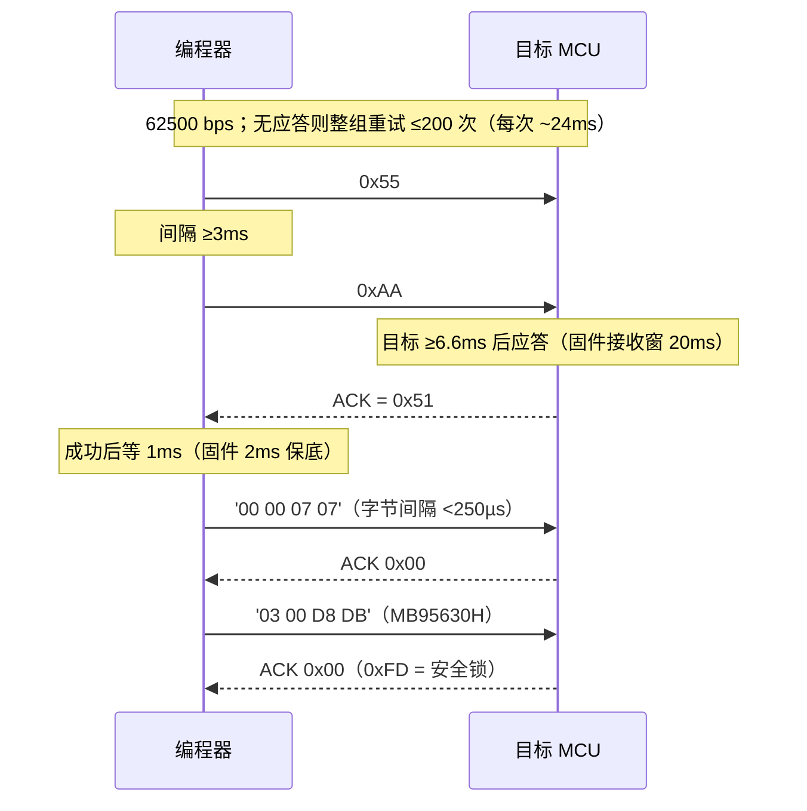
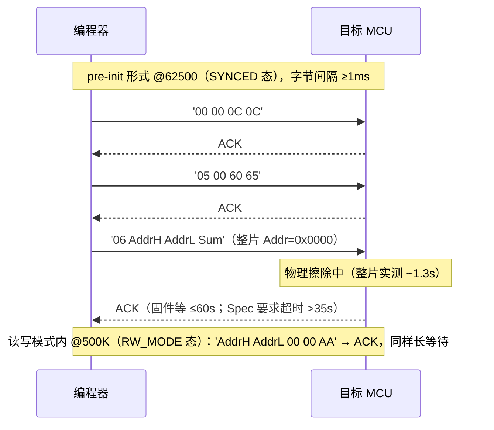
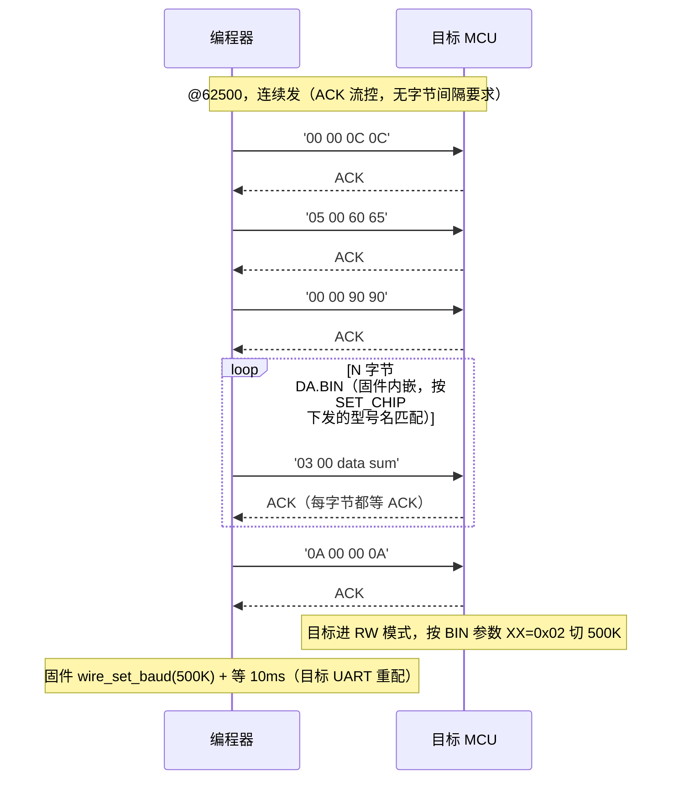
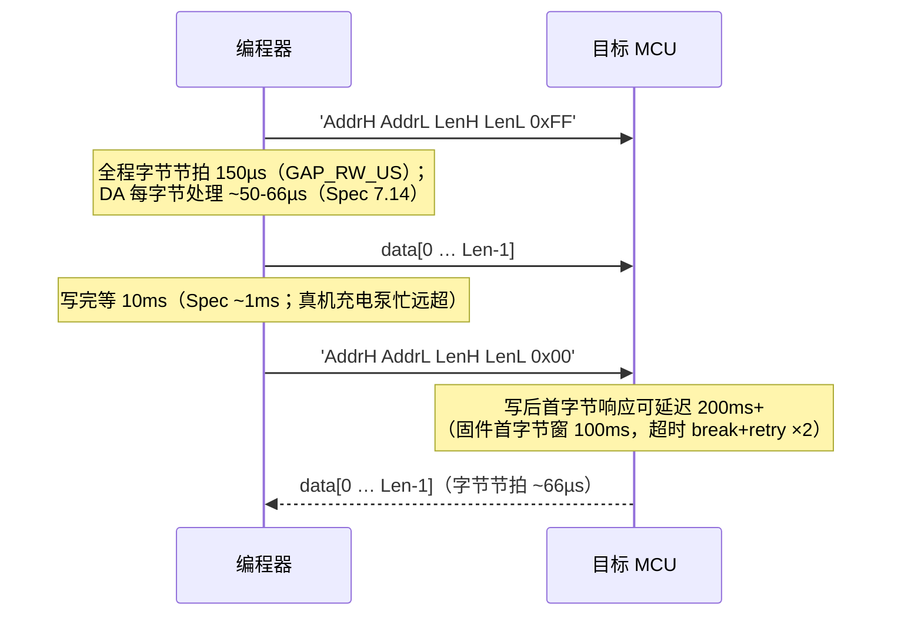
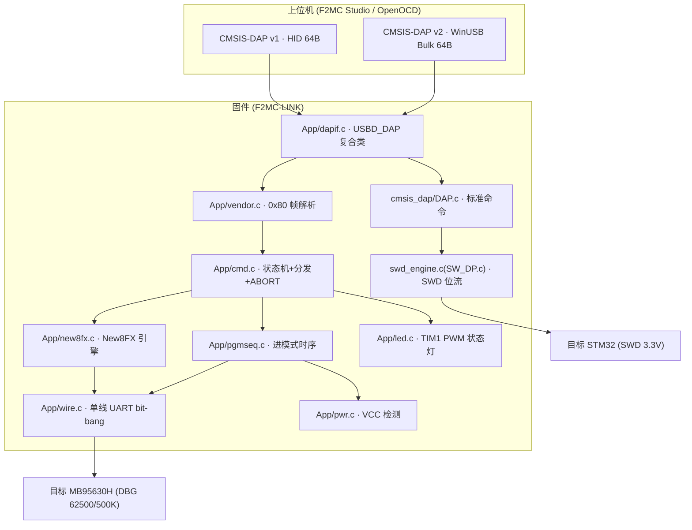
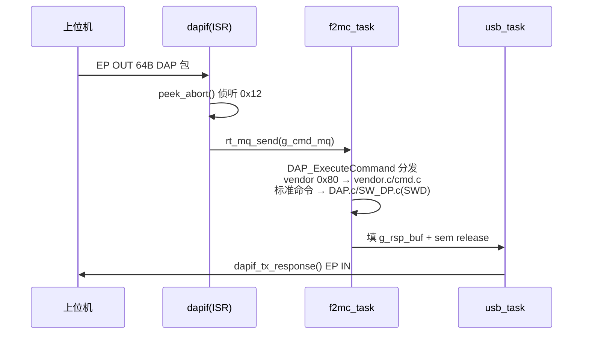

# 固件使用说明（F2MC-LINK）

> 版本 v0.2.0
> 平台：STM32F103C8T6 @72MHz，CubeMX HAL + RT-Thread Nano 4.1.1
> 源码：`firmware/`；上位机侧说明见 `docs/上位机使用说明.md`，协议依据见 `docs/通信协议约定.md`

## §1 概述与快速上手

MB95F630H 系列编程器 + STM32 SWD 调试器二合一固件：USB 侧为 CMSIS-DAP v1(HID)/v2(Bulk)
双接口——F2MC 烧录走 vendor 命令(0x80) → DBG 单线 UART 执行 New8FX 协议；
STM32 烧录/仿真走标准 DAP 命令 → 官方 SWD 引擎（见 §3.6）。

**硬件**（参考 ST-LINK 自制 F2MC-LINK v1.1，原理图见 `diagram/F2MC-LINK_v1.1.pdf`）：

- DBG = PB14(TX 开漏)/PB12(RX) 经 220Ω 并联、33Ω 到目标；
- DBG 上拉 **2.2kΩ** 到目标 VCC（开关后）；
- PA8=PWR_EN 驱动 EL817+SS8050 光电管开关（通流 ≤50mA，可使用 MOS 管方案替代），实现 **自动上电**；
- PB0=ADC1_IN8 经 4.7k:4.7k 分压检测 VCC；
- LED = PA9（TIM1_CH2 PWM）。

**构建**（STM32CubeMX 生成工程，推荐 STM32CubeIDE + ARM-GCC）：

| 步骤 | 操作 |
|---|---|
| 1 | STM32CubeMX 打开 `firmware/F2MC-LINK.ioc` → Generate Code（工具链已设为 STM32CubeIDE，链接器 GCC） |
| 2 | STM32CubeIDE 导入生成的工程并 Build（ARM-GCC）。为产出 hex：Project Properties → C/C++ Build → Settings → MCU Post build outputs → 勾选 **Convert to Intel Hex file** |
| 3 | 产物 `F2MC-LINK.hex`（位于 `Debug/` 或 `Release/` 构建目录下） |

⚠ CubeMX 再生成后必须按 §4 清单逐项恢复手改内容。

---

## §2 New8FX 串行编程协议（固件 ↔ 目标 MCU）

> 本章仅描述固件本地执行的 L2（DBG 单线 UART）。上位机↔编程器的 L1
> （CMSIS-DAP vendor 命令）协议见 `docs/通信协议约定.md`。
> 依据：富士通《(SPEC)New8FX-Serial_PGM-V1.3.0.pdf》§5/§7（获取途径见根 README 致谢节）；
> 时序图参照 Spec 原图按本固件实现重绘（括号内为固件实际参数，`App/new8fx.c`/`App/pgmseq.c`）。

### 2.1 链路与帧约定

- DBG 引脚单线半双工 UART，编程器为主机；初始 **62500 bps**，FLASH_INIT 后切 **500000 bps**。
- 字节格式 8N1、LSB first、空闲高：

```
      空闲   起始  D0 D1 … D7  停止   空闲
 高 ──────┐      ┌──┬─── … ──┬──┐      ┌─────
          └──────┘  （LSB 先发）  └──────┘
          |← 1 位：62500=16µs，500K=2µs →|
```

- 基本命令帧 4 字节 `[功能码/AddrH | 数据H/AddrL | 参数 | Checksum]`，Checksum = 前 3 字节之和；
  目标回 1 字节 ACK：**0x00 正常，0xFD 安全锁**。
- 读写命令为 5 字节头 `[AddrH AddrL LenH LenL 0xFF写/0x00读]` + 数据流。
- ⚠ 每次发送后必须立即进入接收窗口（ACK 早到会被漏采）。

### 2.2 进 PGM 模式时序（Spec 5.2，`App/pgmseq.c`）

```
 VCC ────┐ 上升   稳定判定
         └───┬───────┬─────────┬────────────────────────
 DBG ────┐   │       │         │
         └───┴───────┴─────────┴────┐───────────────────
         推挽拉低                    释放（上拉成形高）
         |← 等VCC>2.5V →|←3×50ms→|←     1.2s     →|
            (10s 超时)   相差<100mV   (Spec 要求 ≥1s)
```

- 要求：VCC 上升期间 DBG 必须已为低（固件在等电前即拉低）；保持 ≥1 s（固件 1.2 s）；RST 不参与。
- ⚠ 带电重进（上次会话后目标仍带电）时，固件**断电前先把 DBG 推挽拉低**：
  DBG 经目标侧 2.2k 上拉接目标 VCC，拉低即以 ~2.3mA@5V 主动泄放目标轨——大 die/大电容目标
  靠自然漏电 + 分压电阻放电又慢又浅，曾致放电超时或 POR 不干净 → 握手 TIMEOUT；
  小 die 放电快不受影响。**放电达标后再保持断电 300ms**（外部轨 ≤0.5V 时大 die 内部轨可能
  仍高于 VPOR），确保内部 POR 深度。
- ⚠ 握手失败时 `new8fx_enter_pgm` 自动整循环重试 ×3（放电 → 上电 → 保持 → 握手），
  覆盖偶发 POR/采样窗口失败（烧录恢复能力的一部分）。
- ⚠ 全过程可被 ABORT(0x12) 中止；任何一步超时/中止都会先释放 DBG。

### 2.3 握手与时钟修改时序（Spec 7.1/7.3，`App/new8fx.c`）



### 2.4 擦除时序（Spec 7.4 pre-init / 7.6 读写模式内）



- ⚠ 末帧**单发不可重试**（重发会撞忙中目标）；头两帧才可 break+retry。
- 超时 ≠ 失败：是否重发由上位机决策。

### 2.5 FLASH_INIT 时序（Spec 7.5）



- ⚠ DA.BIN 内嵌于固件（`App/new8fx.c` 的 `DA_SPEC_M1`），上位机经 `SET_CHIP(0x13)` 下发型号名、
  固件按系列匹配；**DA 与目标 boot ROM 常驻监视器布局严格配对**（反汇编：DA 内含 JMP 0x00xx 绝对
  入口与 CALLV 向量）——结构逆向与实测配对结论见 `docs/DA 结构解析.md`。

### 2.6 读/写时序（Spec 7.7/7.8，@500K）



- ⚠ 背靠背零间隔写会丢字节 → DA 字节计数失配 → 后续命令被吃成写数据。
- 读覆盖全 64KB 地址空间（含 IO 区 0x0FE4 等）。

### 2.7 CR 校准写与退出（Spec 7.9/7.10）

- CR 校准写：`'AddrH AddrL 00 Data 55'`——⚠ **真机 DA 不实现**（回 0xFF），
  CR 恢复改用 §2.6 普通写路径写 0xFFBB 起 3 字节。固件保留该命令但恒回 ACK_ERROR。
- 退出：`'xx xx xx xx 88'`（前 4 字节任意保留值，建议 0x00；无 ACK）；仅读写模式内有效；
  固件随后归位 62500（目标退回 bootloader 世界）。

### 2.8 通信恢复

- 命令失败重试前先 SEND_BREAK（UART Break，拉低 ≥2 帧时长）复位目标通信状态。
- 单命令固件内最多重试 3 次；SECURITY_LOCKED / ABORTED 不重试。
- 不可恢复 → 完整重新上电走 §2.2。

### 2.9 安全锁与 NVR

- **安全锁**：0xFFFC=0x01 写入后断电/QUIT 生效；生效后仅握手+整片擦除可用，
  其余回 0xFD → SECURITY_LOCKED；仅用户显式 `--secure` 时最后写。
- **NVR（0xFFBB~0xFFBF）**：Blank Check/Verify 跳过 0xFFBB/BC/BD；CR Trimming 检查：
  擦除后读 NVR 三字节与 RAM 镜像 0x0FE7/0FE4/0FE5 比较，不一致用普通写路径写回
  （擦除后 MCU 通常已自动回写）；编程结束后再查一次。

### 2.10 性能预算（实测）

进模式 ~1.3 s；握手 11~202 ms；FLASH_INIT(141B) ~80 ms；整片擦除 ~1.3 s；
读 ~66 µs/B；写 ~170 µs/B；整片烧录+校验（35KB）≈ 25~40 s。

---

## §3 固件架构与执行流程

### 3.1 总体分层



### 3.2 线程模型与 IPC

| 线程 | 优先级 | 栈 | 职责 |
|---|---|---|---|
| `usb_task` | 3 | 768 B | 等 `g_rsp_sem` → `dapif_tx_response()` EP IN 回包 |
| `f2mc_task` | 4 | 2048 B | 收 `g_cmd_mq` → `DAP_ExecuteCommand` 分发执行<br/>（标准 SWD 命令与 vendor 0x80 均在此线程）→ 填 `g_rsp_buf` |

LED **无线程**（TIM1 硬件 PWM，中断屏蔽期间照常闪）。
IPC：`g_cmd_mq`（`[iface][len][64B 包]`，ISR 投递）+ `g_rsp_sem` + `g_rsp_buf`。



### 3.3 关键命令执行流（源码引用）

**ENTER_PGM(0x03)**：`cmd.c`（**任何状态可进**——pgmseq 内含完整断电重进，上位机
无需先 QUIT/RESET_RUN）→ `new8fx_enter_pgm()`（先归位 62500；**握手失败时整循环
重试 ×3**——放电 → 上电 → 保持 → 握手，覆盖大 die 目标偶发 POR/采样窗口失败）→ 
`pgmseq_enter()`（放电时 PB14 拉低主动泄放目标轨 → 达标后保持 300ms 保证 POR 深度 → 
等 VCC 稳定 → 1.2s → 释放）→ `handshake()`（0x55/0xAA，200 次）→ `clock_mod()` → SYNCED。

**RESET_RUN(0x0D)**：`pgmseq_power_cycle_run()`——断电 → DBG 拉低主动放电
（等 <0.5V + 300ms 保持）→ 释放 DBG → 上电运行用户程序；响应 DATA[0] 上报复位能力
（0=原生复位引脚/1=模拟断电上电"兼容模式"，本板恒为 1）。

**ERASE(0x04) → FLASH_INIT(0x05)**：SYNCED 态 `erase_preinit`（头两帧 retry + f3 单发
60s）→ ERASED；RW_MODE 态 `erase_post`（500K 单发）→ 保持 RW_MODE。`flash_init`：
3 头帧 + N 帧 DA.BIN（内嵌表按 SET_CHIP 型号匹配）+ 尾帧 → 切 500K + 10ms → RW_MODE。
SYNCED 也可直接 FLASH_INIT（只读/校验路径）。

**写+校验**：WRITE_BEGIN(≤512B)→WRITE_DATA(≤56B/包)→WRITE_COMMIT
（`new8fx_write_mem`：5 字节头+数据流，150µs/字节，写完等 10ms）→
READ_BEGIN（`new8fx_read_mem`：首字节窗 100ms，retry×3）→READ_DATA 分包取回。

**CR 恢复**：普通写路径写 0xFFBB 起 3 字节。

**ABORT(0x12)**：`dapif.c peek_abort()`（ISR 带外置标志）→
`pgmseq/handshake/wire_recv` 轮询 `cmd_abort_pending()` 退出 → 原命令回 ABORTED(0x0B)。

### 3.4 LED 状态语义（`App/led.c`）

| 状态 | 灯效 | 触发 |
|---|---|---|
| OFF | 灭 | 上电；DISCONNECT(0x11) |
| SOLID | 常亮 | 收到首条 L1 命令；命令执行完回空闲 |
| SLOW 0.5Hz | 慢闪 | ENTER_PGM 等待/执行中 |
| FAST 5Hz | 快闪 | 引擎命令执行中 |

已知限制：F1 无 VBUS 检测，直接拔线无法察觉（LED 保持常亮）。

### 3.5 关键实现要点

- **wire.c TX**：PB14 原生开漏输出（CRH=0x7），逐位单次 BSRR/BRR 写 + CYCCNT 滚动
  位边界；`wire_send` 先 BASEPRI/建模式再捕获 t0（否则帧首字节 MSB 恒错）。
- **wire.c RX 两级**：62500 走 EXTI 时间戳 + 任务上下文采样；500K 走 BASEPRI 紧轮询
  + `rx8_500k`（.RamFunc+O2）三点多数表决——⚠ flash 执行 -Og 代码每票 ~2.2µs 超过
  一个位时，采样必漂，时序关键代码必须放 RAM。
- **长超时禁止用 CYCCNT 差值比较**（>29.8s 回绕；擦除 ACK 等待曾因此从未生效）——
  毫秒级等待一律 rt tick。
- **擦除末帧单发不重试**；**写数据 150µs/字节节拍**；**CR 恢复走普通写路径**。

### 3.6 SWD 引擎（STM32 烧录与仿真）

标准 CMSIS-DAP SWD 命令（probe-rs/OpenOCD 发出，不经 vendor 0x80）由官方源码处理：

```
DAP.c（命令解析）→ SW_DP.c（官方 SWD 位流引擎）→ DAP_config.h（引脚端口层宏）
```

- **引脚**：SWCLK=PB13（推挽输出）；SWDIO_OUT=PB14 / SWDIO_IN=PB12（220Ω 并联点），
  目标 3.3V 电平，推挽直接驱动（与 F2MC 5V 开漏设计不同）。
  `PIN_SWDIO_OUT_ENABLE/DISABLE` 切换 PB14 推挽输出↔浮空输入实现 SWDIO 双向。
- **端口仲裁**：`PORT_SWD_SETUP()`（DAP_Connect）把三脚切到 SWD 角色，`PORT_OFF()`
  （DAP_Disconnect/DAP_SETUP）全部释放浮空输入——与 wire_init 防倒灌状态一致。
  ⚠ 同一时刻只允许一类目标会话：SWD 连接期间上位机不得发 F2MC vendor 命令。
- **LED 联动**：DAP_Connect→常亮，DAP_Disconnect→熄灭（`LED_CONNECTED_OUT`）；
  传输活动灯不联动（`LED_RUNNING_OUT` 空操作）。
- **已知限制**：无 nRESET 引脚（ResetTarget/SWJ_Pins 的 nRESET 位无效，烧录后人工断电重启）；
  无 SWO 跟踪；无 JTAG。
- **移植坑**：`PIN_SWDIO_OUT(bit)` 语义是输出**参数的 bit0**（官方 SW_DP.c 的
  `SW_WRITE_BIT` 传整个 val 再 >>=1）；误写成 `(bit)?` 判非零会把 0b10 错驱成 1，
  JTAG-to-SWD 切换序列全乱 → OpenOCD 报 "cannot read IDR"（首测根因）。
  另：SWD 测试前须拔掉共享 SWDIO 网络上的 F2MC 目标（无电芯片 ESD 钳位会把线拉死）。
- **验证**（OpenOCD 非破坏性自检）：
  `openocd -f interface/cmsis-dap.cfg -f target/stm32f1x.cfg -c init -c "flash probe 0" -c shutdown`
  （connect → halt → 读 flash 尺寸寄存器）。
- **速度**（bit-bang 天然慢于原生 SPI 控制器）：默认 SWCLK 名义 4MHz
  （`DAP_DEFAULT_SWJ_CLOCK`，可用 OpenOCD `adapter speed` 覆盖）；官方 SW_DP.c 经
  `App/swd_engine.c` 以 **O2** 包装编译（-O0 宏开销会让实际时钟打对折）。
  实际有效时钟 ≈1.7-2MHz；上位机请走 v2 Bulk 接口（v1 HID 有 1ms 帧调度上限）。

---

## §4 CubeMX 再生成恢复清单

对项目再生成（regenerate）后需按下表逐项恢复。**建议在 CubeMX 内先做永久设置**
（it.c 不生成 Handler）；实在改不了的手改文件注意备份，重生成后按 diff 合回。

| # | 文件 | 位置 | 恢复内容 | 可在 CubeMX 永久设置？ |
|---|---|---|---|---|
| 1 | `Core/Src/main.c` | USER CODE Includes | `#include "prog_tasks.h"` | ❌（生成器保留 USER CODE 区，安全） |
| 2 | `Core/Src/main.c` | USER CODE 1（`HAL_Init()` 前） | `__disable_irq();`——HAL_Init 使能的 1kHz SysTick 会进 pack `board.c` 的 `rt_tick_increase` 解引用空 `rt_current_thread` → HardFault；RTOS 首次上下文切换 `CPSIE I` 自动恢复 | ❌（USER CODE 区安全） |
| 3 | `Core/Src/main.c` | USER CODE 2 | `rtthread_startup();` 启动 RTOS（实现于 `App/prog_tasks.c`，含 `rt_tick_sethook(HAL_IncTick)` 保 HAL 时基） | ❌（USER CODE 区安全） |
| 4 | `Core/Src/stm32f1xx_it.c` | SysTick / PendSV Handler | 删除生成的 `SysTick_Handler()`/`PendSV_Handler()`（与 pack `board.c`/`context_gcc.S` 重复定义） | ✅ NVIC→Code generation 取消勾选 |
| 5 | `USB_DEVICE/App/usb_device.c` | `MX_USB_DEVICE_Init()` | 改用 `DAP_FS_Desc` + `USBD_DAP` 注册（删 `USBD_CUSTOM_HID_RegisterInterface`）；并在 `USBD_Init` 之后补 `hUsbDeviceFS.dev_speed = USBD_SPEED_FULL;`——ST 库不给 dev_speed 赋初值（.bss 清零=HIGH，首次复位回调才修正），Win11 探测 OTHER_SPEED_CONFIGURATION/DEVICE_QUALIFIER 会走类回调空指针致 code43 | ❌ 手改，注意备份 |
| 6 | `USB_DEVICE/Target/usbd_conf.h` | 宏 | `USBD_LPM_ENABLED 1`（BOS/MS OS 2.0 通路）、`USBD_MAX_NUM_INTERFACES 2`、`USBD_SUPPORT_USER_STRING_DESC 1` | ❌ 手改，注意备份 |
| 7 | `USB_DEVICE/Target/usbd_conf.c` | `HAL_PCD_MspInit` | `HAL_NVIC_SetPriority(USB_LP_CAN1_RX0_IRQn, 1, 0)`（生成默认 0，抢占 EXTI 采样） | ❌ 手改，注意备份 |
| 8 | `USB_DEVICE/Target/usbd_conf.c` | `HAL_PCD_MspInit` | EP2 PMA 端点缓冲地址（EP1 继承 CustomHID 布局） | ❌ 手改，注意备份 |
| 9 | `RT-Thread/rtconfig.h` | 全文宏 | ⚠ 实测 CubeMX/pack 再生成会**整体重置**本文件。恢复：`RT_THREAD_PRIORITY_MAX=8`；`RT_USING_USER_MAIN`/`RT_USING_COMPONENTS_INIT` 取消定义；`RT_USING_MESSAGEQUEUE`/`RT_USING_MUTEX`/`RT_USING_OVERFLOW_CHECK`/`RT_HOOK_USING_FUNC_PTR`/`RT_USING_DEVICE` 定义；`RT_USING_CONSOLE`/`RT_USING_FINSH` 保持未定义（逐项说明见文件头注释） | ❌ 手改 |
| 10 | `.cproject`（CubeIDE） | 源列表 / include path / 排除项 | 新增 `App/*.c` 需确认纳入构建；`App`、`App/cmsis_dap` 在 include path；排除 `App/cmsis_dap/SW_DP.c`（由 `App/swd_engine.c` 以 O2 包装编译，防重复编译）——CubeIDE 写 sourceEntry `excluding="cmsis_dap/SW_DP.c"` | ❌（IDE 侧维护，CubeMX 再生成会重置 .cproject） |

**不会被再生成覆盖、无需恢复**：
- pack 自带 `board.c`（`Middlewares/Third_Party/.../cubemx_config/board.c`）：
  **不得覆写**；HAL 时基经 `rt_tick_sethook(HAL_IncTick)` 提供（`App/prog_tasks.c`）。
- `App/` 全部文件；CubeIDE 的 `.project`/`.mxproject`（再生成自动重建）。
- 再生成还会重建 `.cproject`/`.settings/`/`STM32F103C8TX_FLASH.ld` 并改写 `.gitignore`——
  `.cproject` 按上表第 10 项恢复，其余直接使用即可。

## §5 项目结构

```
firmware/
├── App/                  # 核心代码
│   ├── dapif.c/h         # USB 复合类驱动（CMSIS-DAP v1+v2）
│   ├── dapif_desc.c/h    # 设备/字符串/BOS/MS OS 描述符
│   ├── vendor.c/h        # DAP vendor 0x80 帧
│   ├── cmd.c/h           # L1 命令 + 状态机 + ABORT
│   ├── new8fx.c/h        # L2 New8FX 引擎
│   ├── pgmseq.c/h        # 进编程模式时序
│   ├── wire.c/h          # 单线 UART bit-bang（62500/500K）
│   ├── pwr.c/h           # VCC ADC 检测
│   ├── led.c/h           # TIM1 PWM 状态灯
│   ├── swd_engine.c      # SWD 引擎 O2 编译包装（含官方 SW_DP.c）
│   ├── prog_tasks.c/h    # RTOS 线程/IPC
│   ├── drv_pin.c/h       # 最小 pin 设备
│   ├── rtt_log.c/h       # SEGGER RTT 日志
│   └── cmsis_dap/        # ARM CMSIS-DAP 官方实现（DAP.c/SW_DP.c + 移植层 DAP_config.h）
├── Core/                 # CubeMX 生成（勿改）
├── Drivers/              # CubeMX 生成（勿改）
├── Middlewares/          # CubeMX 生成（勿改）
├── USB_DEVICE/           # CubeMX 生成（勿改）
├── .gitignore
└── F2MC-LINK.ioc         # CubeMX 工程（再生成前必读 §4）
```
